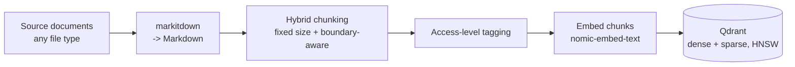
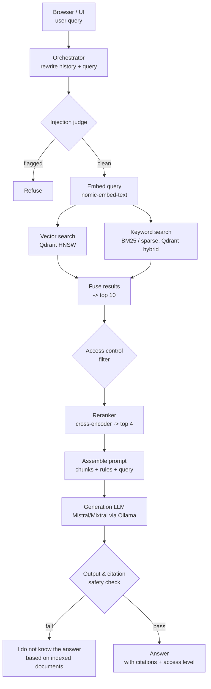

# Agentic RAG

A production-grade agentic retrieval-augmented generation system that answers
questions grounded strictly in an indexed document corpus, with per-user
access control, source citations, and multi-turn chat.

Full spec: [`docs/REQUIREMENTS.md`](docs/REQUIREMENTS.md) · Build plan &
status: [`PROJECT_TRACKER.md`](PROJECT_TRACKER.md) · Working agreement:
[`.claude/CLAUDE.md`](.claude/CLAUDE.md)

## Stack decisions

- **Language:** Python
- **Vector store:** Qdrant (HNSW, native hybrid dense + sparse search)
- **Generation model:** Mistral / Mixtral, served locally via Ollama
- **Embedding model:** `nomic-embed-text`, served locally via Ollama
- **Reranker:** local open-source cross-encoder (`bge-reranker-v2-m3`-class)
- **Evaluation:** Claude (Anthropic API) used as an evaluator/judge, not as the RAG generator
- **Agent orchestration:** custom agent loop, no framework (LangGraph/LlamaIndex not used)
- **Ingestion:** [`markitdown`](https://github.com/microsoft/markitdown) converts any source file type to Markdown

## Architecture

### Ingestion & indexing

### Query journey

Embedding and semantic caches sit alongside the embed/retrieval steps to keep
repeat and similar-meaning queries fast (see `docs/REQUIREMENTS.md` §7). If a
query is complex, the orchestrator may decompose it into sub-questions and
retry retrieval up to 5 times before falling back to the "I do not know"
response (§10).

## Status

Phase 0 (project foundations) in progress — see
[`PROJECT_TRACKER.md`](PROJECT_TRACKER.md) for the full phased roadmap and
live status of every phase.

<!-- Phase log: append a short entry here each time a phase ships. -->
