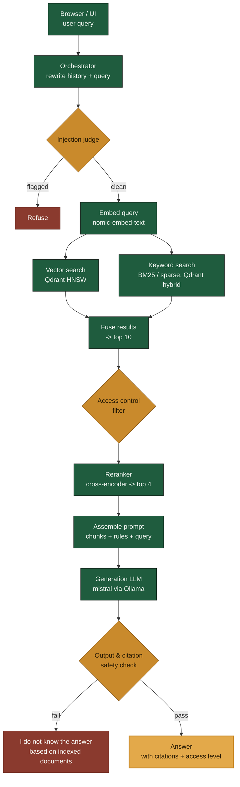

# Agentic RAG

A production-grade agentic retrieval-augmented generation system that answers
questions grounded strictly in an indexed document corpus, with per-user
access control, source citations, and multi-turn chat.

Full spec: [`docs/REQUIREMENTS.md`](docs/REQUIREMENTS.md) · Build plan &
status: [`PROJECT_TRACKER.md`](PROJECT_TRACKER.md) · Working agreement:
[`.claude/CLAUDE.md`](.claude/CLAUDE.md)

**Live demo walkthrough:**
[sumukhak.github.io/agentic-rag/artifact/walkthrough.html](https://sumukhak.github.io/agentic-rag/artifact/walkthrough.html)
— stage-by-stage tour of the pipeline using real output from a recorded
evaluation run (also committed as a standalone copy in
[`artifact/`](artifact/)).

## Stack decisions

- **Language:** Python
- **Vector store:** Qdrant (HNSW, native hybrid dense + sparse search)
- **Generation model:** `mistral`, served locally via Ollama (pulled
  during Phase 4 — Mixtral was the other originally-considered option but
  is ~26GB vs. mistral's ~4.1GB, not warranted for local dev)
- **Embedding model:** `nomic-embed-text`, served locally via Ollama
- **Reranker:** local open-source cross-encoder (`bge-reranker-v2-m3`-class)
- **Evaluation:** `qwen2.5:14b-instruct`, served locally via Ollama, for offline quality evaluation only (Phase 8) — pivoted away from Claude since no `ANTHROPIC_API_KEY` was configured for this project (Phase 8 decision, `PROJECT_TRACKER.md`'s "Structured evaluation" entry); not the injection judge, output/citation safety check, or foul-language check below, which all use the local `mistral` model (Phase 6 decision, `docs/REQUIREMENTS.md` §13)
- **Agent orchestration:** custom agent loop, no framework (LangGraph/LlamaIndex not used)
- **Ingestion:** [`markitdown`](https://github.com/microsoft/markitdown) converts any source file type to Markdown

## Architecture

### Ingestion & indexing


### Query journey



Embedding and semantic caches sit alongside the embed/retrieval steps to keep
repeat and similar-meaning queries fast (see `docs/REQUIREMENTS.md` §7). If a
query is complex, the orchestrator may decompose it into sub-questions and
retry retrieval up to 5 times before falling back to the "I do not know"
response (§10).

## Deployment

**`Dockerfile` has never actually been built or run.** Docker isn't
installed in this project's development environment (`docker --version`
→ "command not found"), so this was written carefully against
documented `uv`/Python/Docker conventions but couldn't be verified with
a real `docker build`/`docker run`. Treat it as a first draft to
validate the first time it's actually built, not a proven artifact.

**Scope, chosen deliberately:** containerizes the FastAPI app only.
Qdrant stays embedded/on-disk inside the container (matching
`docs/REQUIREMENTS.md`'s existing "local/embedded mode for now"
decision — not something this pass changes), and Ollama is expected to
keep running on the host, the same way local (non-Docker) development
already reaches it. A full multi-service stack (containerized Qdrant
server + containerized Ollama) is a bigger architectural change than
"hardening" — see the [Scaling to 150,000
Documents](#scaling-to-150000-documents-theoretical) section above for
why moving off embedded Qdrant specifically would need its own ADR
first, not just a Dockerfile.

### Building and running

```bash
docker build -t agentic-rag .

# Linux: reach host Ollama via --network=host, or add the gateway host
# explicitly. Mac/Windows (Docker Desktop): host.docker.internal
# resolves to the host automatically.
docker run -p 8000:8000 \
  -e WATCHED_FOLDER_PATH=/data/corpus \
  -e OLLAMA_BASE_URL=http://host.docker.internal:11434 \
  -v /path/to/your/corpus:/data/corpus:ro \
  -v agentic-rag-data:/app/data \
  agentic-rag
```

`WATCHED_FOLDER_PATH` has no default (`src/agentic_rag/config.py`) and
must be bind-mounted from the host — the corpus lives outside the
container. `/app/data` (Qdrant's embedded storage and the sync
snapshot) should be a named volume so both persist across container
restarts; without it, a restart re-indexes the whole corpus from
scratch (a wasteful but not incorrect outcome — see
`ingestion/scheduler.py`'s own docstring on why snapshot persistence
matters).

### Health checks

- `GET /health` — liveness: "is the process up." Never depends on
  Qdrant/Ollama; a non-200 here means the process itself is the
  problem.
- `GET /health/ready` — readiness: "can this actually serve a request
  right now." Checks Qdrant and Ollama reachability, returns 503 (not
  200) if either is unreachable, and the response body names which one.
  The Docker image's own `HEALTHCHECK` deliberately points at `/health`
  (liveness), not `/health/ready` — see the Dockerfile's own comment for
  why routing a container-restart signal at a dependency-reachability
  check would be the wrong altitude for plain `docker run` (a real
  orchestrator with separate liveness/readiness probes should route
  them to the two endpoints respectively).

### Backup & recovery

Qdrant runs in local/embedded mode here (no Docker in this dev
environment), and its own snapshot API doesn't support that mode
(`create_snapshot()` raises `NotImplementedError` for local Qdrant) — so
the background sync loop periodically copies the whole embedded storage
directory to a timestamped, rotated backup instead
(`qdrant_backup_path`/`qdrant_backup_interval_seconds`/
`qdrant_backup_retention_count`, default: hourly, keep the last 3). This
is scoped to protect against *whole-index* loss (a corrupted on-disk
store, a bad shutdown) — accidentally deleting a single document from the
index is already cheap to recover from without a backup, since the
watched folder, not Qdrant, is this system's source of truth (the next
sync cycle just re-ingests that one file). See
[`docs/REQUIREMENTS.md` §15](docs/REQUIREMENTS.md) for the full reasoning,
including why a full rebuild specifically isn't a viable fallback at this
project's target scale.

**Restoring is a manual operator action, not automatic code**: stop the
app, then point `qdrant_storage_path` at a chosen backup directory (or
copy it over the live path) before restarting — the running process holds
the live path open, so nothing can safely swap it out from underneath
itself. Live-verified: a real point written to a real collection, backed
up, then read back correctly by a fresh client pointed directly at the
backup directory (the same mechanism restoring uses).

Every `POST /query` request also gets a server-minted `request_id` (a
UUID, never accepted from the client) threaded through its structured log
line, so two concurrent requests' log output can be told apart and
correlated — see `docs/REQUIREMENTS.md` §15 for what prompted this.

## Scaling to 150,000 Documents (Theoretical)

`docs/REQUIREMENTS.md` §2 sets the system's actual target at **10,000
documents averaging ~50 pages each** (≈500,000 pages) — that target is
unchanged, and Phase 8's load test still validates against it, not this
section. This is a separate, explicitly theoretical exercise: what would
break, and what would have to change, to run this same architecture at
**15× that document count — 150,000 documents, still averaging ~50 pages
each (≈7.5 million pages)** — worked out from real measurements on this
project's own development machine, not guessed numbers.

### Measurement methodology

Actually indexing 150,000 real ~50-page documents through live Ollama
embedding calls on this machine (a laptop-class GTX 1650 Ti, 4GB VRAM,
16GB system RAM — the same hardware this whole session's Ollama
GPU-OOM/timeout incidents came from) would itself take on the order of
weeks (see below) — not a practical calibration run. Instead, **10 real,
full-size (~50-page) synthetic documents were indexed through the actual
production pipeline** (`run_sync_cycle()` — the exact code path the
background sync job and `POST /query` share, not a separate benchmark
harness) against real Ollama and real embedded Qdrant, via a throwaway
calibration script (not committed to this repo — a one-off measurement
tool, not a feature), and the measured per-document/per-chunk numbers
below are extrapolated linearly to 150,000 documents.

One methodological pitfall worth naming because it was hit and fixed
during this measurement: the first calibration attempt generated each
document by cycling through the same small pool of paragraph text,
which produced near-identical chunk text across documents —
`EmbeddingCache` (keyed by exact `(model, text)`, see
`src/agentic_rag/embedding/cache.py`) recognized the repeats and skipped
re-embedding most of them, making the measured throughput roughly 2.7×
faster than reality. The corrected run generates genuinely unique text
in every chunk of every document, so every embedding call actually hits
Ollama — the numbers below are from that corrected run.

**This is still only a 10-document sample, and it should be read as
one.** The same small-sample fragility that produced the 2.7× cache-hit
artifact above applies to the corrected run too, just less visibly — 10
documents is enough to catch a gross measurement error, not enough to
bound real per-document variance (a first request against a possibly
cold-loaded model, normal Ollama request-latency jitter, and so on).
Every number below derived from this sample — including the headline
18.4-day figure — should be read as order-of-magnitude, not a specific
day count precise to one decimal place.

### Measured baseline (10 documents, ~50 pages each)

| Metric | Measured value |
|---|---|
| Documents | 10 |
| Total characters | 1,500,404 (150,040/doc avg) |
| Total chunks (`chunk_size_chars=2000`) | 790 (79/doc avg) |
| Total wall time | 106.0s |
| Time per document | ≈10.6s |
| Time per chunk | ≈0.134s |
| Qdrant storage (dense + sparse vectors + payload) | 9,798,239 bytes (9.34 MB) |
| Storage per document | 979,824 bytes (0.93 MB) |
| Storage per chunk | 12,403 bytes (12.1 KB) |

### Extrapolation to 150,000 documents

Scaling the measured per-document/per-chunk rates linearly by 15,000×
(150,000 ÷ 10):

| Metric | Extrapolated value |
|---|---|
| Total pages | 7,500,000 |
| Total characters | ≈22.5 billion (≈22.5 GB of raw Markdown) |
| Total chunks | ≈11,850,000 |
| **Total ingestion time (current architecture)** | **≈1,590,000s ≈ 441.7 hours ≈ 18.4 days**, continuous, uninterrupted, best case |
| Total Qdrant storage | ≈147 GB (11,850,000 × 12,403 bytes) |
| Dense vectors alone, in RAM, at `float32` (768-dim, no HNSW graph overhead) | ≈36.4 GB |
| Dense vectors + typical HNSW graph overhead (~30–50%) | ≈47–55 GB, to keep the whole index resident in RAM the way Qdrant's default config prefers |

**18.4 days for a from-scratch initial load is not a viable number for a
system whose own requirement (§2) is "fast and reliable."** That single
figure is the headline finding this whole exercise exists to produce —
and it is, if anything, an optimistic one. The linear extrapolation
above holds per-chunk cost flat across the whole run, but at least two
real effects would make actual ingestion slower, not just larger: HNSW
insert cost is known to grow with graph size (the calibration ran
against a graph of ~790 points; the extrapolated target is ~11.85
million), and 18 days of continuous operation is long enough for
sustained-load effects this short calibration run couldn't observe at
all — GPU thermal throttling on a 4GB-VRAM laptop card, and
filesystem/mmap performance as the on-disk Qdrant store grows toward
147GB. Neither effect is quantified here; both push the real number
higher than 18.4 days, not lower.

### Where the current architecture breaks down

1. **Ingestion is effectively single-threaded.** `run_sync_cycle()`
   (`src/agentic_rag/ingestion/scheduler.py`) processes documents one at
   a time in a plain `for` loop — each document's chunks are batched
   into one embedding call (`embed_with_cache()`), but documents
   themselves are never processed concurrently. At the measured
   0.134s/chunk, hitting even a modest "reindex the whole corpus
   overnight" target (24 hours) for 11,850,000 chunks requires
   **≈0.00729s/chunk — an ≈18.4× throughput improvement** over what one
   process, one small GPU, and no batching currently delivers.

2. **Embedded Qdrant is single-process by design.** `get_client()`
   (`src/agentic_rag/indexing/qdrant_setup.py`) opens Qdrant in
   local/embedded mode — its own docstring already documents why:
   *"Docker isn't available in this dev environment - see
   docs/REQUIREMENTS.md §5. Swappable for a real server later by passing
   a `url=` instead of `path=` here."* This isn't a scale-triggered
   discovery, it's a pre-existing, explicitly deferred decision — but
   150,000 documents is exactly the scale where deferring it stops being
   free: embedded mode holds an exclusive file lock, so no second
   process (a parallel ingestion worker, a horizontally-scaled API
   replica) can touch the same collection at all.

3. **`EmbeddingCache` is unbounded by design** (its own docstring:
   *"unbounded (no eviction) - fine for one sync cycle at a time, but §7
   already flags eviction policy as an explicit open item, not something
   to invent here."*). That's a reasonable bet at 10,000 documents. At
   150,000, if the initial corpus load were ever attempted as one giant
   `run_sync_cycle()` call (which `sync_folder()`'s diff-the-whole-folder
   design would naturally attempt if all 150,000 files simply appeared
   in the watched folder at once — verified: `watcher.py`'s `snapshot()`
   walks the whole folder in one pass, with no existing batching), the
   cache would try to hold an embedding for every one of the ≈11.85
   million unique chunks simultaneously. Estimating from CPython's
   actual object overhead (a `dict` keyed by `(model, text)`; dense
   values are `list[float]`, sparse values are `SparseVector` objects,
   not `list[float]`): each dense entry costs roughly 26–27 KB (a ~2 KB
   text key plus a 768-element Python list, whose per-float object
   overhead dwarfs the theoretical 3 KB of packed `float32` data), and
   each sparse entry roughly 7 KB. Across 11.85 million chunks (one
   dense + one sparse cache entry each), that's **on the order of
   390–410 GB of RAM** for a single cache — roughly 25× this development
   machine's 16 GB, and still several times more than most single
   servers. This is an order-of-magnitude estimate, not a precise
   figure (and the per-entry byte counts above mix binary-KB and
   decimal-GB conventions loosely, which is part of why the range is
   wide) — the magnitude is the point: no realistic amount of "just add
   more RAM" fixes a single-mega-cycle design at this scale; the cache's
   *scope* would need to shrink instead.

### What would actually need to change

None of this is proposed as work to start now, and none of it is a
decided plan — Phase 8's load test still targets the real
10,000-document requirement. Per this repo's own `.claude/CLAUDE.md` §1
("never invent architecture or requirements... everything built must
trace back to `docs/REQUIREMENTS.md`, an ADR, or an explicit instruction
from the user"), nothing below is grounded in a real requirement, so
none of it should be built without a real decision first — a future ADR
if it's ever pursued, not this document. What follows is this
theoretical exercise's answer to "what would the numbers above point
to," not a roadmap:

- **Batching the initial corpus load, instead of one giant cycle,** is
  the one change that could plausibly happen with no new infrastructure
  at all — feeding the watched-folder diff through `run_sync_cycle()` in
  bounded batches (e.g. 1,000–5,000 documents at a time, persisting the
  snapshot between batches) rather than one 150,000-document pass would
  let each batch's `EmbeddingCache` get garbage-collected before the
  next batch starts, turning the ≈390–410 GB single-cycle estimate above
  into a bounded, per-batch cost instead.
- **Parallelizing document processing** would need to be bounded by real
  embedding capacity, not just thread count — the ≈18.4× throughput gap
  can't be closed by thread-level concurrency alone if every worker
  still queues against the same single-GPU Ollama instance, since this
  machine's GPU, not orchestration overhead, is the real ceiling (the
  same conclusion this session's own documented Ollama GPU-OOM history
  already points to). Closing that gap would need *more or better
  embedding serving capacity* to parallelize against — multiple
  GPU-backed embedding workers, a batched-inference serving layer, or a
  hosted embedding API — combined with parallelizing this codebase's own
  per-document loop across that added capacity. This codebase already
  has one precedent for running independent Ollama calls concurrently
  via a thread pool (`_screen_input()`'s `ThreadPoolExecutor` in
  `api/routers/query.py`), though at a much smaller, fixed scale (two
  parallel judge calls) than parallelizing an unbounded 150,000-document
  loop would require.
- **Moving off embedded Qdrant to a real deployment** is already flagged
  as a deferred decision in the code itself; 150,000 documents is the
  point where it would stop being deferrable if this scale were ever a
  real target — a standalone Qdrant server (or cluster, sharded across
  nodes) would remove the single-process file lock, enable horizontal
  scaling of both ingestion workers and query-serving replicas, and give
  access to Qdrant's on-disk/quantization options for keeping the
  ≈47–55 GB HNSW index within a realistic RAM budget rather than
  requiring it fully resident.
- **Bounding `EmbeddingCache`**, not just batching around it, would turn
  the cache from "unbounded, safe only because nothing has forced the
  issue yet" into a value with an actual, documented, tested limit — an
  LRU cap (evicting least-recently-used entries past a configured size)
  even alongside batched loading, rather than an open item load-bearing
  on nobody ever running a big-enough batch to notice.
- **A real distributed ingestion pipeline** would be the natural next
  step if batching and added embedding capacity still didn't close the
  gap to an acceptable reindex time at this scale — the current design
  is intentionally a single `asyncio` background task in one process,
  and 150,000 documents is roughly the scale where that tradeoff's cost
  becomes visible in the numbers above.

## Real 10,000-Document Load Test — Results

Everything above this section is theoretical, extrapolated from a
10-document calibration run. This section is the real thing: an actual
attempt at `docs/REQUIREMENTS.md` §2's real target (10,000 documents,
~50 pages average), run against this project's own development machine
(GTX 1650 Ti, 4GB VRAM, 16GB RAM) via `src/agentic_rag/loadtest/` (see
[`loadtest/README.md`](loadtest/README.md) for the full write-up).

**It did not complete.** The run was stopped at **6,000 / 10,000
documents (60%)** after repeatedly hitting a real memory-scaling wall
this hardware couldn't sustain past that point:

- Per-document indexing time held roughly steady (≈17.5s/doc) for the
  first 4,800 documents, then degraded **~3x** (to ≈52.2s/doc) for the
  next 1,200 — not gradually, but as a clear step change.
- `nvidia-smi` ruled out GPU thermal throttling as the cause (60-62°C,
  idle between calls). The actual cause was system RAM exhaustion: free
  memory (16GB total) was repeatedly observed down to **~1GB free**, with
  the load-test process's own resident memory climbing past 6.6GB and
  still growing as the embedded Qdrant collection's HNSW index grew.
- The process died once with no error and no recorded reboot (consistent
  with a silent OOM kill), and after two separate resumes (the
  crash-recovery design worked correctly both times — no data was lost)
  hit the identical wall again within hours each time, making zero
  further progress while the system thrashed under the same memory
  pressure.
- 5,999 of 6,000 documents indexed cleanly (1 isolated failure);
  measured chunk count (79.4/doc) and storage (≈0.94 MB/doc) both closely
  matched the 150k analysis's own 10-document calibration — the failure
  mode here is specifically about *sustained* memory growth over a real
  run, not a discrepancy in the underlying per-document numbers.

**This confirms, with real measured data, the exact risk the 150k
theoretical analysis above could only flag as unquantified** ("HNSW
insert cost is known to grow with graph size... neither effect is
quantified here") — except the wall was hit at 6,000 documents, short of
even this project's own real target, not just in a 15x-larger
hypothetical. The fix is architectural, not a load-test change: moving
off embedded/in-memory Qdrant (a real server with on-disk vector storage,
or sharding) before this scale is attempted again, exactly as the "where
the current architecture breaks down" section above already concluded —
now with a real, reproduced failure behind that conclusion instead of
only a projection.

The query-latency phase (measuring `POST /query` against the fully-loaded
index) never ran, since the process never reached it — that measurement
remains genuinely unmeasured pending an architecture change, not just
unfavorable.

