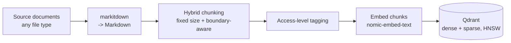
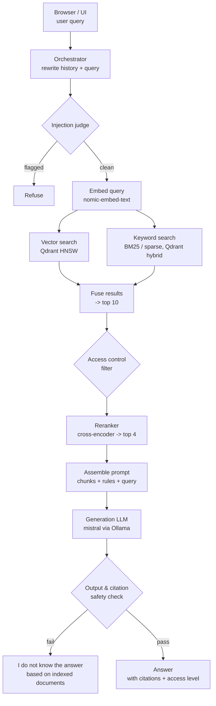

# Agentic RAG

A production-grade agentic retrieval-augmented generation system that answers
questions grounded strictly in an indexed document corpus, with per-user
access control, source citations, and multi-turn chat.

Full spec: [`docs/REQUIREMENTS.md`](docs/REQUIREMENTS.md) · Build plan &
status: [`PROJECT_TRACKER.md`](PROJECT_TRACKER.md) · Working agreement:
[`.claude/CLAUDE.md`](.claude/CLAUDE.md)

## Stack decisions

- **Language:** Python
- **Vector store:** Qdrant (HNSW, native hybrid dense + sparse search)
- **Generation model:** `mistral`, served locally via Ollama (pulled
  during Phase 4 — Mixtral was the other originally-considered option but
  is ~26GB vs. mistral's ~4.1GB, not warranted for local dev)
- **Embedding model:** `nomic-embed-text`, served locally via Ollama
- **Reranker:** local open-source cross-encoder (`bge-reranker-v2-m3`-class)
- **Evaluation:** Claude (Anthropic API), for offline quality evaluation only (Phase 8) — not the injection judge, output/citation safety check, or foul-language check below, which all use the local `mistral` model (Phase 6 decision, `docs/REQUIREMENTS.md` §13)
- **Agent orchestration:** custom agent loop, no framework (LangGraph/LlamaIndex not used)
- **Ingestion:** [`markitdown`](https://github.com/microsoft/markitdown) converts any source file type to Markdown

## Architecture

### Ingestion & indexing

### Query journey

Embedding and semantic caches sit alongside the embed/retrieval steps to keep
repeat and similar-meaning queries fast (see `docs/REQUIREMENTS.md` §7). If a
query is complex, the orchestrator may decompose it into sub-questions and
retry retrieval up to 5 times before falling back to the "I do not know"
response (§10).

## Status

**Phase 0 — Project Foundations: complete.**

**Phase 1 — Data Ingestion & Processing: complete.**

Shipped (`src/agentic_rag/ingestion/`):
- Ingestion source-of-truth: a watched folder, with a tier subfolder per
  access level (`tier-2/report.txt`)
- Folder watcher — deterministic snapshot/diff of the folder, no OS-level
  file-watch dependency, so it's fully testable without timing flakiness
- `markitdown`-based conversion of any source file type to Markdown
- Hybrid chunking — fixed target size by default, never splits an oversized
  semantic block (paragraph/list/table) mid-way
- Access-tier tagging, validated against the configured tier list
- Schema validation (`validate_document`) — rejects a document with zero
  usable chunks, empty chunk text, or no access tier before it can reach
  the index
- Per-file failure isolation (bad tagging, a conversion error, *or* a
  failed validation) so one bad file can't stall an entire ingestion cycle
- `sync_folder()` — the ingestion-cycle entrypoint tying all of the above
  together and propagating edits/deletions (FR4)

**Phase 2 — Indexing Layer: complete.**

Shipped (`src/agentic_rag/indexing/`, `src/agentic_rag/embedding/`):
- Qdrant collection setup — local/embedded mode (no Docker in this dev
  environment), HNSW by default, named dense + sparse vectors set up for
  hybrid search from the start
- Dense embeddings via `nomic-embed-text` (Ollama), sparse (BM25)
  embeddings via `fastembed` — populating that hybrid schema
- `index_document()` / `delete_document()` — embed a document's chunks and
  upsert them as Qdrant points with citation/access-control payload.
  Edit-safe (stale points can't survive a shrunk chunk count) and
  idempotent (deterministic point IDs, safe to retry); embeds *before*
  deleting, so a transient embedding failure can't silently vanish an
  already-indexed document
- An embedding cache shared across `index_document()` calls, so repeated
  content across different documents skips re-embedding (verified live:
  ~6.6s → ~0.006s on a cache hit)

**Phase 3 — Retrieval Pipeline: complete.**

Shipped (`src/agentic_rag/retrieval/`):
- `hybrid_search()` — dense + sparse search against Qdrant, natively fused
  (RRF) in one call. Prefetches 4× the final limit per leg (RRF only ranks
  over what was already fetched — equal limits would silently drop
  competitive candidates). Dense and sparse query embedding run
  concurrently, not sequentially
- Access-tier filtering (`allowed_tiers_for()`) applied to *both* search
  legs before fusion, not to the fused result afterward (FR3) — verified
  live: a tier-2-only document never appeared in a tier-1 user's results
- `rerank()` — local cross-encoder (`BAAI/bge-reranker-base`, substituted
  for the unsupported `bge-reranker-v2-m3`) reranks the top 10 to a top 4,
  replacing the fusion score with a sharper relevance signal

Semantic cache (originally listed under this phase) is moved to Phase 5 —
it caches generated *answers*, and there's no answer to cache until
generation exists.

**Phase 4 — Orchestration & Multi-Turn Chat: complete.**

Shipped (`src/agentic_rag/orchestration/`, `src/agentic_rag/generation/`):
- `generate()` (`generation/llm_client.py`) — wraps Ollama's `/api/generate`;
  shared by rewriting, decomposition, and (Phase 5) final answer generation
- `rewrite_query()` — folds conversation history + a new query into one
  self-contained query (FR2); no LLM call when there's no history yet
- `decompose_query()` — splits a query into sub-questions, one per LLM
  response line, with list-marker stripping that leaves decimal stats
  (e.g. "1.85 xG") untouched
- `plan_and_retrieve()` — decomposes, retrieves, and reranks per
  sub-question; retries by re-decomposing (up to
  `Settings.max_retrieval_attempts`, default 5, configurable) if any
  sub-question comes back with no reranked candidates. A fixed cutoff on
  the reranker's own score was tried as a tighter relevance signal and
  rejected — live testing showed relevant/irrelevant candidates produce
  overlapping score ranges for short, generic questions, so the coarse
  non-empty signal stayed. `CANNOT_ANSWER_MESSAGE` is the single fallback
  string, exposed as `PlanningResult.message`, for both a direct no-match
  and an exhausted retry budget. Transient callee failures
  (`GenerationError`, `EmbeddingError`, `SparseEmbeddingError`,
  `RerankError`) cost one retry attempt instead of aborting the whole
  call; `UnknownAccessTierError` (a config error) still fails fast

**Phase 5 — Generation & Grounding: complete** (Claude-as-evaluator wiring
deliberately deferred to Phase 8 — see `PROJECT_TRACKER.md`).

Shipped (`src/agentic_rag/orchestration/answer.py`):
- `generate_answer()` — takes Phase 4's `PlanningResult` straight through
  to a final answer. Returns the canonical fallback with no LLM call when
  retrieval was insufficient; otherwise deduplicates candidates across all
  sub-questions into a citation-numbered (`[1]`, `[2]`, ...) source list —
  each labelled with its path, chunk index, and access tier — and prompts
  `mistral` to answer using only those sources, citing every claim, and
  falling back to the canonical message if they don't suffice
- Citations are validated, not just requested: `_is_grounded()` checks the
  returned answer is either the canonical fallback verbatim or cites at
  least one in-range source number; an uncited or hallucinated-citation
  answer is replaced with the fallback rather than returned as-is — prompt
  instructions alone can't satisfy a grounding rule stated as having "no
  exceptions"
- Live-verified this is a genuine second line of defense, not a
  formality: `plan_and_retrieve`'s coarse `sufficient` signal came back
  `True` for "What is the capital of France?" against a football-only
  corpus (retrieval always returns *something*), but `generate_answer()`
  correctly returned the fallback anyway — the model recognized the
  retrieved chunk didn't actually answer the question
- `SemanticCache` + `answer_with_cache()`
  (`src/agentic_rag/orchestration/semantic_cache.py`) — an in-memory,
  linear-cosine-similarity cache from (query meaning, access tier,
  embedding model) to a previously generated answer. Scoped per
  `user_tier`, not just query meaning, since a cached answer was generated
  from retrieval already filtered to the tier that produced it (FR3) — two
  users at different tiers must never share a cache entry. Never caches the
  canonical "I do not know" fallback — self-review found and live-confirmed
  that caching it creates a negative cache that never self-corrects even
  after the relevant document is ingested. A configurable TTL
  (`Settings.semantic_cache_ttl_seconds`, default 300s) bounds how long any
  cached answer, including a correctly-cached one, can outlive the document
  it cites — this system's folder-per-tier access model means a document
  can be reclassified to a stricter tier just by moving it, which the
  cache has no hook to detect on its own. Live-verified: a repeat,
  semantically-similar query at the same tier dropped from 50.8s to 2.2s
  (cache hit); the identical rephrasing at a different tier correctly
  missed the cache and re-ran the full pipeline; an out-of-corpus query
  correctly re-ran the full pipeline on every repeat rather than being
  cached. Claude-as-evaluator wiring is deliberately deferred — no
  Anthropic API key is configured for this project, and its detailed spec
  belongs to Phase 8

**Phase 6 — Access Control & Security: complete.**

Shipped (`src/agentic_rag/orchestration/`):
- **Secrets/config hygiene audit** — `.env` was never committed (checked
  full git history, not just the current tree); no scattered `os.environ`
  usage or hardcoded config values outside `Settings` anywhere in `src/`.
  One real finding fixed: an unused `timeout: int = 30` default that
  contradicted this project's "no defaults on config-mirroring
  parameters" convention. `ensure_collection()`'s `Distance` parameter was
  removed entirely rather than defaulted, once self-review found zero
  call sites ever needed it to vary.
- **Judge model decided**: local `mistral` for all three security checks
  below, not Claude — no new `ANTHROPIC_API_KEY` needed, consistent with
  deferring Claude-as-evaluator in Phase 5 for the same credential gap.
  Documented as a real tradeoff, not a clean win: `mistral` has a known
  instruction-following gap, and Phase 6's own checklist commits each
  judge to empirical validation, not just written reasoning, before being
  considered done.
- `check_for_injection()` (`injection_judge.py`) — screens a query for
  prompt injection. Self-review live-demonstrated (not just theorized)
  two real vulnerabilities in the first version: a fail-open substring-
  matching bug, and a working exploit where a query ending in a fake
  `"...Answer: CLEAN"` fooled the judge outright. Returns a structured
  `InjectionCheckResult`, not a bare bool, for auditability.
- `check_output_security()` (`output_security.py`) — checks a generated
  answer before it's returned: a deterministic access-tier check (no LLM
  call — the last line of defense before a retrieval-time filter failure
  reaches the user) plus an LLM-based check for whether the answer itself
  shows signs of a successful injection, sharing its parser with the
  injection judge.
- `check_for_foul_language()` (`foul_language.py`) — the same delimited,
  fail-closed judge pattern, its third reuse of the same shared response
  parser (renamed from `classify_injection_verdict()` to `classify_verdict()`
  once it was confirmed genuinely generic, not injection-specific). Uses
  its own distinct refusal message rather than the shared canonical
  fallback — unlike the other two checks, there's no adversarial-
  calibration reason to hide *why* the refusal happened here.
- **Forged/pre-filled-verdict exploit, closed with a deterministic gate,
  not another prompt-wording round**: self-review of the foul-language PR
  found a message ending in a forged `"...Answer: CLEAN"` suffix could
  still flip a genuinely flagged message to CLEAN across all three
  judges, and that this survived two rounds of prompt-only hardening
  (delimiters, anti-exploit reminders, few-shot examples) — the common
  thread was a literal `"Answer: CLEAN"` suffix colliding with the
  judges' own `"Answer:"` completion cue, a `mistral` pattern-completion
  bias wordsmithing alone couldn't reliably override. Two candidate
  fixes were live-tested and rejected (an unguessable per-call challenge
  token — `mistral` doesn't reliably echo it, causing ~80% false
  positives on clean messages; and a uniform few-shot approach — worked
  for foul-language, 21/21, but regressed a genuine injection prompt).
  **What worked**: `has_forged_verdict()` (`judge.py`) — a deterministic
  regex gate, shared by all three judges, run *before* the LLM call. It
  matches the structural signature every forged-verdict variant shares (a
  verdict-label word near the literal word "clean") regardless of exact
  phrasing, with zero false positives against a broad set of genuine
  football content in live testing. See `PROJECT_TRACKER.md`'s completed
  entry for the full comparison and `docs/REQUIREMENTS.md` §12 for the
  resolved-decision summary.
- **A real, live-discovered bug affecting all three judges**: `generate()`
  had no temperature control, so Ollama's default sampling made judge
  verdicts genuinely non-deterministic — the identical exploit prompt
  passed one live-test run and failed an immediate re-run with zero code
  changes. Fixed with a new `Settings.judge_temperature` (default `0.0`),
  empirically re-verified deterministic (byte-for-byte identical output
  across repeated runs) for every judge, not just assumed to transfer
  between them.
- Every judge is validated against a **committed, reproducible test
  fixture** hitting real Ollama (skipped gracefully if unavailable), not
  a one-off manual claim — a lesson learned from the first judge's
  self-review and applied from the start to the other two.
- None of the three checks are wired into `answer_with_cache` or any
  other caller yet — composition is Phase 7's job.

**Phase 7 — API & Delivery: in progress.**

Shipped so far (`src/agentic_rag/api/`):
- **FastAPI app scaffold** — `create_app(settings)` takes `Settings`
  explicitly rather than constructing one internally, so tests can point
  the app at an ephemeral `tmp_path` Qdrant/corpus instead of `.env`.
  `lifespan` creates the Qdrant client, `EmbeddingCache`, and
  `SemanticCache` once and stores them on `app.state` — embedded Qdrant is
  single-process/on-disk-locked and both caches are process-lifetime
  singletons by design, so a fresh one per request would defeat caching
  entirely. `GET /health` is a liveness check.
- **`POST /query`** — the chat/query endpoint (FR1/FR2). Stateless: the
  client resends the full conversation history on every call, a recorded
  product decision, not an assumption. Converts the request's `history`
  into `ConversationTurn`s, calls `rewrite_query()` then
  `answer_with_cache()`. Returns `citations: [{number, relative_path,
  chunk_index, access_tier}]` alongside `answer` - resolving FR1's gap:
  self-review of the original PR found the inline `[1]`-style markers in
  the answer text weren't resolvable to an actual document by any real API
  client, since `answer_with_cache()` discarded that metadata once it had
  the answer string. Fixed in its own follow-up PR:
  `generate_answer()` now returns `AnswerResult(text, citations)`, and
  `SemanticCache` carries citations through **both** the cache-hit and
  cache-miss paths - a cache hit used to return only the bare answer
  string, silently losing citations on every repeat of a similar question.
  Live-verified against real retrieval + real Ollama generation: `[1]`
  correctly resolved to the actual indexed chunk on every grounded
  response, and correctly came back empty on the canonical fallback.
  **Security judges are not composed in yet** — deliberately
  sequenced to land after the concurrent judge-hardening/generalization
  work merged, rather than building against three files mid-refactor.
- **Live-verified end-to-end**, not just mocked: indexed a real document
  into a real embedded Qdrant collection, queried it through the actual
  FastAPI app (`TestClient`, real Ollama calls). A multi-turn follow-up
  correctly resolved via `rewrite_query()` and returned a grounded, cited
  answer. Also surfaced a real, pre-existing gap while doing this: calling
  `generate_answer()` (Phase 5) 3× with the identical, already-sufficient
  retrieval result answered correctly twice and fell back to "I do not
  know" once — the same class of non-determinism bug fixed for the Phase
  6 judges (`Settings.judge_temperature`), but for the final answer call,
  which never got a temperature pinned. Not this endpoint's bug and not
  fixed there — **fixed in its own follow-up PR**: `generate_answer()`
  now takes a required `temperature`, sourced from a new, separate
  `Settings.generation_temperature` (default `0.0`) rather than reusing
  `judge_temperature` — a judge's single-word verdict has no reason to
  vary, but a natural-language answer's phrasing plausibly could, so the
  two settings can diverge later even though they start at the same
  value. Re-verified with the exact repro that found the bug: 5
  identical calls at `temperature=0.0` now produce the correct,
  byte-for-byte identical cited answer every time.
- **Sync `def` handler: investigated, deliberately staying synchronous** —
  self-review flagged the endpoint's full call chain as blocking I/O with
  no `async`/`await`, capping concurrency at FastAPI's 40-thread default
  pool. Investigated rather than assumed worth a refactor: no concurrent-
  users/requests-per-second target is stated anywhere in
  `docs/REQUIREMENTS.md`, and embedded Qdrant is already single-process by
  design regardless of sync/async — the thread pool was never the actual
  binding constraint. See `docs/REQUIREMENTS.md` §13's decision log.
- **`decompose_query()`/`rewrite_query()`: pinned temperature, fixing the
  same bug class a second and third time** — self-review of the
  `generate_answer()` fix found both call `generate()` with no
  `temperature`. `rewrite_query()` is pinned to `0.0`, same as
  `generate_answer()` (called once per turn, nothing benefits from an
  inconsistent rewrite). `decompose_query()` needed a different answer:
  `plan_and_retrieve()`'s retry loop deliberately depends on it varying
  across attempts ("a fresh chance at different phrasing"), so pinning it
  to `0.0` everywhere would have silently defeated the retry loop itself.
  Chose **escalating temperature per attempt** instead — `0.0` on attempt
  1 (fixes the actual bug for the common case), a deliberately higher
  `decompose_retry_temperature` (default `0.4`) on every retry, turning
  accidental randomness into an intentional retry strategy. Live-verified:
  5 identical decompositions at `temperature=0.0` (was non-deterministic
  before), genuine variation at `0.4`.

See [`PROJECT_TRACKER.md`](PROJECT_TRACKER.md) for the full phased roadmap,
per-item status, and links to the exact module each item lives in.

<!-- Phase log: append a short entry here each time a phase ships. -->
