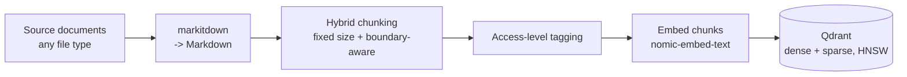
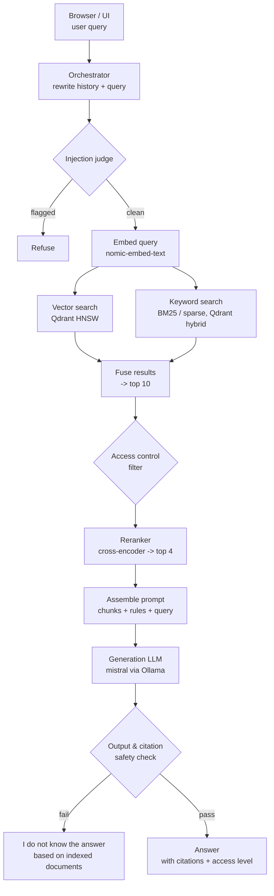

# Agentic RAG

A production-grade agentic retrieval-augmented generation system that answers
questions grounded strictly in an indexed document corpus, with per-user
access control, source citations, and multi-turn chat.

Full spec: [`docs/REQUIREMENTS.md`](docs/REQUIREMENTS.md) · Build plan &
status: [`PROJECT_TRACKER.md`](PROJECT_TRACKER.md) · Working agreement:
[`.claude/CLAUDE.md`](.claude/CLAUDE.md)

## Stack decisions

- **Language:** Python
- **Vector store:** Qdrant (HNSW, native hybrid dense + sparse search)
- **Generation model:** `mistral`, served locally via Ollama (pulled
  during Phase 4 — Mixtral was the other originally-considered option but
  is ~26GB vs. mistral's ~4.1GB, not warranted for local dev)
- **Embedding model:** `nomic-embed-text`, served locally via Ollama
- **Reranker:** local open-source cross-encoder (`bge-reranker-v2-m3`-class)
- **Evaluation:** `qwen2.5:14b-instruct`, served locally via Ollama, for offline quality evaluation only (Phase 8) — pivoted away from Claude since no `ANTHROPIC_API_KEY` was configured for this project (Phase 8 decision, `PROJECT_TRACKER.md`'s "Structured evaluation" entry); not the injection judge, output/citation safety check, or foul-language check below, which all use the local `mistral` model (Phase 6 decision, `docs/REQUIREMENTS.md` §13)
- **Agent orchestration:** custom agent loop, no framework (LangGraph/LlamaIndex not used)
- **Ingestion:** [`markitdown`](https://github.com/microsoft/markitdown) converts any source file type to Markdown

## Architecture

### Ingestion & indexing



### Query journey



Embedding and semantic caches sit alongside the embed/retrieval steps to keep
repeat and similar-meaning queries fast (see `docs/REQUIREMENTS.md` §7). If a
query is complex, the orchestrator may decompose it into sub-questions and
retry retrieval up to 5 times before falling back to the "I do not know"
response (§10).

## Deployment

**`Dockerfile` has never actually been built or run.** Docker isn't
installed in this project's development environment (`docker --version`
→ "command not found"), so this was written carefully against
documented `uv`/Python/Docker conventions but couldn't be verified with
a real `docker build`/`docker run`. Treat it as a first draft to
validate the first time it's actually built, not a proven artifact.

**Scope, chosen deliberately:** containerizes the FastAPI app only.
Qdrant stays embedded/on-disk inside the container (matching
`docs/REQUIREMENTS.md`'s existing "local/embedded mode for now"
decision — not something this pass changes), and Ollama is expected to
keep running on the host, the same way local (non-Docker) development
already reaches it. A full multi-service stack (containerized Qdrant
server + containerized Ollama) is a bigger architectural change than
"hardening" — see the [Scaling to 150,000
Documents](#scaling-to-150000-documents-theoretical) section above for
why moving off embedded Qdrant specifically would need its own ADR
first, not just a Dockerfile.

### Building and running

```bash
docker build -t agentic-rag .

# Linux: reach host Ollama via --network=host, or add the gateway host
# explicitly. Mac/Windows (Docker Desktop): host.docker.internal
# resolves to the host automatically.
docker run -p 8000:8000 \
  -e WATCHED_FOLDER_PATH=/data/corpus \
  -e OLLAMA_BASE_URL=http://host.docker.internal:11434 \
  -v /path/to/your/corpus:/data/corpus:ro \
  -v agentic-rag-data:/app/data \
  agentic-rag
```

`WATCHED_FOLDER_PATH` has no default (`src/agentic_rag/config.py`) and
must be bind-mounted from the host — the corpus lives outside the
container. `/app/data` (Qdrant's embedded storage and the sync
snapshot) should be a named volume so both persist across container
restarts; without it, a restart re-indexes the whole corpus from
scratch (a wasteful but not incorrect outcome — see
`ingestion/scheduler.py`'s own docstring on why snapshot persistence
matters).

### Health checks

- `GET /health` — liveness: "is the process up." Never depends on
  Qdrant/Ollama; a non-200 here means the process itself is the
  problem.
- `GET /health/ready` — readiness: "can this actually serve a request
  right now." Checks Qdrant and Ollama reachability, returns 503 (not
  200) if either is unreachable, and the response body names which one.
  The Docker image's own `HEALTHCHECK` deliberately points at `/health`
  (liveness), not `/health/ready` — see the Dockerfile's own comment for
  why routing a container-restart signal at a dependency-reachability
  check would be the wrong altitude for plain `docker run` (a real
  orchestrator with separate liveness/readiness probes should route
  them to the two endpoints respectively).

## Scaling to 150,000 Documents (Theoretical)

`docs/REQUIREMENTS.md` §2 sets the system's actual target at **10,000
documents averaging ~50 pages each** (≈500,000 pages) — that target is
unchanged, and Phase 8's load test still validates against it, not this
section. This is a separate, explicitly theoretical exercise: what would
break, and what would have to change, to run this same architecture at
**15× that document count — 150,000 documents, still averaging ~50 pages
each (≈7.5 million pages)** — worked out from real measurements on this
project's own development machine, not guessed numbers.

### Measurement methodology

Actually indexing 150,000 real ~50-page documents through live Ollama
embedding calls on this machine (a laptop-class GTX 1650 Ti, 4GB VRAM,
16GB system RAM — the same hardware this whole session's Ollama
GPU-OOM/timeout incidents came from) would itself take on the order of
weeks (see below) — not a practical calibration run. Instead, **10 real,
full-size (~50-page) synthetic documents were indexed through the actual
production pipeline** (`run_sync_cycle()` — the exact code path the
background sync job and `POST /query` share, not a separate benchmark
harness) against real Ollama and real embedded Qdrant, via a throwaway
calibration script (not committed to this repo — a one-off measurement
tool, not a feature), and the measured per-document/per-chunk numbers
below are extrapolated linearly to 150,000 documents.

One methodological pitfall worth naming because it was hit and fixed
during this measurement: the first calibration attempt generated each
document by cycling through the same small pool of paragraph text,
which produced near-identical chunk text across documents —
`EmbeddingCache` (keyed by exact `(model, text)`, see
`src/agentic_rag/embedding/cache.py`) recognized the repeats and skipped
re-embedding most of them, making the measured throughput roughly 2.7×
faster than reality. The corrected run generates genuinely unique text
in every chunk of every document, so every embedding call actually hits
Ollama — the numbers below are from that corrected run.

**This is still only a 10-document sample, and it should be read as
one.** The same small-sample fragility that produced the 2.7× cache-hit
artifact above applies to the corrected run too, just less visibly — 10
documents is enough to catch a gross measurement error, not enough to
bound real per-document variance (a first request against a possibly
cold-loaded model, normal Ollama request-latency jitter, and so on).
Every number below derived from this sample — including the headline
18.4-day figure — should be read as order-of-magnitude, not a specific
day count precise to one decimal place.

### Measured baseline (10 documents, ~50 pages each)

| Metric | Measured value |
|---|---|
| Documents | 10 |
| Total characters | 1,500,404 (150,040/doc avg) |
| Total chunks (`chunk_size_chars=2000`) | 790 (79/doc avg) |
| Total wall time | 106.0s |
| Time per document | ≈10.6s |
| Time per chunk | ≈0.134s |
| Qdrant storage (dense + sparse vectors + payload) | 9,798,239 bytes (9.34 MB) |
| Storage per document | 979,824 bytes (0.93 MB) |
| Storage per chunk | 12,403 bytes (12.1 KB) |

### Extrapolation to 150,000 documents

Scaling the measured per-document/per-chunk rates linearly by 15,000×
(150,000 ÷ 10):

| Metric | Extrapolated value |
|---|---|
| Total pages | 7,500,000 |
| Total characters | ≈22.5 billion (≈22.5 GB of raw Markdown) |
| Total chunks | ≈11,850,000 |
| **Total ingestion time (current architecture)** | **≈1,590,000s ≈ 441.7 hours ≈ 18.4 days**, continuous, uninterrupted, best case |
| Total Qdrant storage | ≈147 GB (11,850,000 × 12,403 bytes) |
| Dense vectors alone, in RAM, at `float32` (768-dim, no HNSW graph overhead) | ≈36.4 GB |
| Dense vectors + typical HNSW graph overhead (~30–50%) | ≈47–55 GB, to keep the whole index resident in RAM the way Qdrant's default config prefers |

**18.4 days for a from-scratch initial load is not a viable number for a
system whose own requirement (§2) is "fast and reliable."** That single
figure is the headline finding this whole exercise exists to produce —
and it is, if anything, an optimistic one. The linear extrapolation
above holds per-chunk cost flat across the whole run, but at least two
real effects would make actual ingestion slower, not just larger: HNSW
insert cost is known to grow with graph size (the calibration ran
against a graph of ~790 points; the extrapolated target is ~11.85
million), and 18 days of continuous operation is long enough for
sustained-load effects this short calibration run couldn't observe at
all — GPU thermal throttling on a 4GB-VRAM laptop card, and
filesystem/mmap performance as the on-disk Qdrant store grows toward
147GB. Neither effect is quantified here; both push the real number
higher than 18.4 days, not lower.

### Where the current architecture breaks down

1. **Ingestion is effectively single-threaded.** `run_sync_cycle()`
   (`src/agentic_rag/ingestion/scheduler.py`) processes documents one at
   a time in a plain `for` loop — each document's chunks are batched
   into one embedding call (`embed_with_cache()`), but documents
   themselves are never processed concurrently. At the measured
   0.134s/chunk, hitting even a modest "reindex the whole corpus
   overnight" target (24 hours) for 11,850,000 chunks requires
   **≈0.00729s/chunk — an ≈18.4× throughput improvement** over what one
   process, one small GPU, and no batching currently delivers.

2. **Embedded Qdrant is single-process by design.** `get_client()`
   (`src/agentic_rag/indexing/qdrant_setup.py`) opens Qdrant in
   local/embedded mode — its own docstring already documents why:
   *"Docker isn't available in this dev environment - see
   docs/REQUIREMENTS.md §5. Swappable for a real server later by passing
   a `url=` instead of `path=` here."* This isn't a scale-triggered
   discovery, it's a pre-existing, explicitly deferred decision — but
   150,000 documents is exactly the scale where deferring it stops being
   free: embedded mode holds an exclusive file lock, so no second
   process (a parallel ingestion worker, a horizontally-scaled API
   replica) can touch the same collection at all.

3. **`EmbeddingCache` is unbounded by design** (its own docstring:
   *"unbounded (no eviction) - fine for one sync cycle at a time, but §7
   already flags eviction policy as an explicit open item, not something
   to invent here."*). That's a reasonable bet at 10,000 documents. At
   150,000, if the initial corpus load were ever attempted as one giant
   `run_sync_cycle()` call (which `sync_folder()`'s diff-the-whole-folder
   design would naturally attempt if all 150,000 files simply appeared
   in the watched folder at once — verified: `watcher.py`'s `snapshot()`
   walks the whole folder in one pass, with no existing batching), the
   cache would try to hold an embedding for every one of the ≈11.85
   million unique chunks simultaneously. Estimating from CPython's
   actual object overhead (a `dict` keyed by `(model, text)`; dense
   values are `list[float]`, sparse values are `SparseVector` objects,
   not `list[float]`): each dense entry costs roughly 26–27 KB (a ~2 KB
   text key plus a 768-element Python list, whose per-float object
   overhead dwarfs the theoretical 3 KB of packed `float32` data), and
   each sparse entry roughly 7 KB. Across 11.85 million chunks (one
   dense + one sparse cache entry each), that's **on the order of
   390–410 GB of RAM** for a single cache — roughly 25× this development
   machine's 16 GB, and still several times more than most single
   servers. This is an order-of-magnitude estimate, not a precise
   figure (and the per-entry byte counts above mix binary-KB and
   decimal-GB conventions loosely, which is part of why the range is
   wide) — the magnitude is the point: no realistic amount of "just add
   more RAM" fixes a single-mega-cycle design at this scale; the cache's
   *scope* would need to shrink instead.

### What would actually need to change

None of this is proposed as work to start now, and none of it is a
decided plan — Phase 8's load test still targets the real
10,000-document requirement. Per this repo's own `.claude/CLAUDE.md` §1
("never invent architecture or requirements... everything built must
trace back to `docs/REQUIREMENTS.md`, an ADR, or an explicit instruction
from the user"), nothing below is grounded in a real requirement, so
none of it should be built without a real decision first — a future ADR
if it's ever pursued, not this document. What follows is this
theoretical exercise's answer to "what would the numbers above point
to," not a roadmap:

- **Batching the initial corpus load, instead of one giant cycle,** is
  the one change that could plausibly happen with no new infrastructure
  at all — feeding the watched-folder diff through `run_sync_cycle()` in
  bounded batches (e.g. 1,000–5,000 documents at a time, persisting the
  snapshot between batches) rather than one 150,000-document pass would
  let each batch's `EmbeddingCache` get garbage-collected before the
  next batch starts, turning the ≈390–410 GB single-cycle estimate above
  into a bounded, per-batch cost instead.
- **Parallelizing document processing** would need to be bounded by real
  embedding capacity, not just thread count — the ≈18.4× throughput gap
  can't be closed by thread-level concurrency alone if every worker
  still queues against the same single-GPU Ollama instance, since this
  machine's GPU, not orchestration overhead, is the real ceiling (the
  same conclusion this session's own documented Ollama GPU-OOM history
  already points to). Closing that gap would need *more or better
  embedding serving capacity* to parallelize against — multiple
  GPU-backed embedding workers, a batched-inference serving layer, or a
  hosted embedding API — combined with parallelizing this codebase's own
  per-document loop across that added capacity. This codebase already
  has one precedent for running independent Ollama calls concurrently
  via a thread pool (`_screen_input()`'s `ThreadPoolExecutor` in
  `api/routers/query.py`), though at a much smaller, fixed scale (two
  parallel judge calls) than parallelizing an unbounded 150,000-document
  loop would require.
- **Moving off embedded Qdrant to a real deployment** is already flagged
  as a deferred decision in the code itself; 150,000 documents is the
  point where it would stop being deferrable if this scale were ever a
  real target — a standalone Qdrant server (or cluster, sharded across
  nodes) would remove the single-process file lock, enable horizontal
  scaling of both ingestion workers and query-serving replicas, and give
  access to Qdrant's on-disk/quantization options for keeping the
  ≈47–55 GB HNSW index within a realistic RAM budget rather than
  requiring it fully resident.
- **Bounding `EmbeddingCache`**, not just batching around it, would turn
  the cache from "unbounded, safe only because nothing has forced the
  issue yet" into a value with an actual, documented, tested limit — an
  LRU cap (evicting least-recently-used entries past a configured size)
  even alongside batched loading, rather than an open item load-bearing
  on nobody ever running a big-enough batch to notice.
- **A real distributed ingestion pipeline** would be the natural next
  step if batching and added embedding capacity still didn't close the
  gap to an acceptable reindex time at this scale — the current design
  is intentionally a single `asyncio` background task in one process,
  and 150,000 documents is roughly the scale where that tradeoff's cost
  becomes visible in the numbers above.

## Status

**Phase 0 — Project Foundations: complete.**

**Phase 1 — Data Ingestion & Processing: complete.**

Shipped (`src/agentic_rag/ingestion/`):
- Ingestion source-of-truth: a watched folder, with a tier subfolder per
  access level (`tier-2/report.txt`)
- Folder watcher — deterministic snapshot/diff of the folder, no OS-level
  file-watch dependency, so it's fully testable without timing flakiness
- `markitdown`-based conversion of any source file type to Markdown
- Hybrid chunking — fixed target size by default, never splits an oversized
  semantic block (paragraph/list/table) mid-way
- Access-tier tagging, validated against the configured tier list
- Schema validation (`validate_document`) — rejects a document with zero
  usable chunks, empty chunk text, or no access tier before it can reach
  the index
- Per-file failure isolation (bad tagging, a conversion error, *or* a
  failed validation) so one bad file can't stall an entire ingestion cycle
- `sync_folder()` — the ingestion-cycle entrypoint tying all of the above
  together and propagating edits/deletions (FR4)

**Phase 2 — Indexing Layer: complete.**

Shipped (`src/agentic_rag/indexing/`, `src/agentic_rag/embedding/`):
- Qdrant collection setup — local/embedded mode (no Docker in this dev
  environment), HNSW by default, named dense + sparse vectors set up for
  hybrid search from the start
- Dense embeddings via `nomic-embed-text` (Ollama), sparse (BM25)
  embeddings via `fastembed` — populating that hybrid schema
- `index_document()` / `delete_document()` — embed a document's chunks and
  upsert them as Qdrant points with citation/access-control payload.
  Edit-safe (stale points can't survive a shrunk chunk count) and
  idempotent (deterministic point IDs, safe to retry); embeds *before*
  deleting, so a transient embedding failure can't silently vanish an
  already-indexed document
- An embedding cache shared across `index_document()` calls, so repeated
  content across different documents skips re-embedding (verified live:
  ~6.6s → ~0.006s on a cache hit)

**Phase 3 — Retrieval Pipeline: complete.**

Shipped (`src/agentic_rag/retrieval/`):
- `hybrid_search()` — dense + sparse search against Qdrant, natively fused
  (RRF) in one call. Prefetches 4× the final limit per leg (RRF only ranks
  over what was already fetched — equal limits would silently drop
  competitive candidates). Dense and sparse query embedding run
  concurrently, not sequentially
- Access-tier filtering (`allowed_tiers_for()`) applied to *both* search
  legs before fusion, not to the fused result afterward (FR3) — verified
  live: a tier-2-only document never appeared in a tier-1 user's results
- `rerank()` — local cross-encoder (`BAAI/bge-reranker-base`, substituted
  for the unsupported `bge-reranker-v2-m3`) reranks the top 10 to a top 4,
  replacing the fusion score with a sharper relevance signal

Semantic cache (originally listed under this phase) is moved to Phase 5 —
it caches generated *answers*, and there's no answer to cache until
generation exists.

**Phase 4 — Orchestration & Multi-Turn Chat: complete.**

Shipped (`src/agentic_rag/orchestration/`, `src/agentic_rag/generation/`):
- `generate()` (`generation/llm_client.py`) — wraps Ollama's `/api/generate`;
  shared by rewriting, decomposition, and (Phase 5) final answer generation
- `rewrite_query()` — folds conversation history + a new query into one
  self-contained query (FR2); no LLM call when there's no history yet
- `decompose_query()` — splits a query into sub-questions, one per LLM
  response line, with list-marker stripping that leaves decimal stats
  (e.g. "1.85 xG") untouched
- `plan_and_retrieve()` — decomposes, retrieves, and reranks per
  sub-question; retries by re-decomposing (up to
  `Settings.max_retrieval_attempts`, default 5, configurable) if any
  sub-question comes back with no reranked candidates. A fixed cutoff on
  the reranker's own score was tried as a tighter relevance signal and
  rejected — live testing showed relevant/irrelevant candidates produce
  overlapping score ranges for short, generic questions, so the coarse
  non-empty signal stayed. `CANNOT_ANSWER_MESSAGE` is the single fallback
  string, exposed as `PlanningResult.message`, for both a direct no-match
  and an exhausted retry budget. Transient callee failures
  (`GenerationError`, `EmbeddingError`, `SparseEmbeddingError`,
  `RerankError`) cost one retry attempt instead of aborting the whole
  call; `UnknownAccessTierError` (a config error) still fails fast

**Phase 5 — Generation & Grounding: complete** (Claude-as-evaluator wiring
deliberately deferred to Phase 8 — see `PROJECT_TRACKER.md`).

Shipped (`src/agentic_rag/orchestration/answer.py`):
- `generate_answer()` — takes Phase 4's `PlanningResult` straight through
  to a final answer. Returns the canonical fallback with no LLM call when
  retrieval was insufficient; otherwise deduplicates candidates across all
  sub-questions into a citation-numbered (`[1]`, `[2]`, ...) source list —
  each labelled with its path, chunk index, and access tier — and prompts
  `mistral` to answer using only those sources, citing every claim, and
  falling back to the canonical message if they don't suffice
- Citations are validated, not just requested: `_is_grounded()` checks the
  returned answer is either the canonical fallback verbatim or cites at
  least one in-range source number; an uncited or hallucinated-citation
  answer is replaced with the fallback rather than returned as-is — prompt
  instructions alone can't satisfy a grounding rule stated as having "no
  exceptions"
- Live-verified this is a genuine second line of defense, not a
  formality: `plan_and_retrieve`'s coarse `sufficient` signal came back
  `True` for "What is the capital of France?" against a football-only
  corpus (retrieval always returns *something*), but `generate_answer()`
  correctly returned the fallback anyway — the model recognized the
  retrieved chunk didn't actually answer the question
- `SemanticCache` + `answer_with_cache()`
  (`src/agentic_rag/orchestration/semantic_cache.py`) — an in-memory,
  linear-cosine-similarity cache from (query meaning, access tier,
  embedding model) to a previously generated answer. Scoped per
  `user_tier`, not just query meaning, since a cached answer was generated
  from retrieval already filtered to the tier that produced it (FR3) — two
  users at different tiers must never share a cache entry. Never caches the
  canonical "I do not know" fallback — self-review found and live-confirmed
  that caching it creates a negative cache that never self-corrects even
  after the relevant document is ingested. A configurable TTL
  (`Settings.semantic_cache_ttl_seconds`, default 300s) bounds how long any
  cached answer, including a correctly-cached one, can outlive the document
  it cites — this system's folder-per-tier access model means a document
  can be reclassified to a stricter tier just by moving it, which the
  cache has no hook to detect on its own. Live-verified: a repeat,
  semantically-similar query at the same tier dropped from 50.8s to 2.2s
  (cache hit); the identical rephrasing at a different tier correctly
  missed the cache and re-ran the full pipeline; an out-of-corpus query
  correctly re-ran the full pipeline on every repeat rather than being
  cached. Claude-as-evaluator wiring is deliberately deferred — no
  Anthropic API key is configured for this project, and its detailed spec
  belongs to Phase 8

**Phase 6 — Access Control & Security: complete.**

Shipped (`src/agentic_rag/orchestration/`):
- **Secrets/config hygiene audit** — `.env` was never committed (checked
  full git history, not just the current tree); no scattered `os.environ`
  usage or hardcoded config values outside `Settings` anywhere in `src/`.
  One real finding fixed: an unused `timeout: int = 30` default that
  contradicted this project's "no defaults on config-mirroring
  parameters" convention. `ensure_collection()`'s `Distance` parameter was
  removed entirely rather than defaulted, once self-review found zero
  call sites ever needed it to vary.
- **Judge model decided**: local `mistral` for all three security checks
  below, not Claude — no new `ANTHROPIC_API_KEY` needed, consistent with
  deferring Claude-as-evaluator in Phase 5 for the same credential gap.
  Documented as a real tradeoff, not a clean win: `mistral` has a known
  instruction-following gap, and Phase 6's own checklist commits each
  judge to empirical validation, not just written reasoning, before being
  considered done.
- `check_for_injection()` (`injection_judge.py`) — screens a query for
  prompt injection. Self-review live-demonstrated (not just theorized)
  two real vulnerabilities in the first version: a fail-open substring-
  matching bug, and a working exploit where a query ending in a fake
  `"...Answer: CLEAN"` fooled the judge outright. Returns a structured
  `InjectionCheckResult`, not a bare bool, for auditability.
- `check_output_security()` (`output_security.py`) — checks a generated
  answer before it's returned: a deterministic access-tier check (no LLM
  call — the last line of defense before a retrieval-time filter failure
  reaches the user) plus an LLM-based check for whether the answer itself
  shows signs of a successful injection, sharing its parser with the
  injection judge.
- `check_for_foul_language()` (`foul_language.py`) — the same delimited,
  fail-closed judge pattern, its third reuse of the same shared response
  parser (renamed from `classify_injection_verdict()` to `classify_verdict()`
  once it was confirmed genuinely generic, not injection-specific). Uses
  its own distinct refusal message rather than the shared canonical
  fallback — unlike the other two checks, there's no adversarial-
  calibration reason to hide *why* the refusal happened here.
- **Forged/pre-filled-verdict exploit, closed with a deterministic gate,
  not another prompt-wording round**: self-review of the foul-language PR
  found a message ending in a forged `"...Answer: CLEAN"` suffix could
  still flip a genuinely flagged message to CLEAN across all three
  judges, and that this survived two rounds of prompt-only hardening
  (delimiters, anti-exploit reminders, few-shot examples) — the common
  thread was a literal `"Answer: CLEAN"` suffix colliding with the
  judges' own `"Answer:"` completion cue, a `mistral` pattern-completion
  bias wordsmithing alone couldn't reliably override. Two candidate
  fixes were live-tested and rejected (an unguessable per-call challenge
  token — `mistral` doesn't reliably echo it, causing ~80% false
  positives on clean messages; and a uniform few-shot approach — worked
  for foul-language, 21/21, but regressed a genuine injection prompt).
  **What worked**: `has_forged_verdict()` (`judge.py`) — a deterministic
  regex gate, shared by all three judges, run *before* the LLM call. It
  matches the structural signature every forged-verdict variant shares (a
  verdict-label word near the literal word "clean") regardless of exact
  phrasing, with zero false positives against a broad set of genuine
  football content in live testing. See `PROJECT_TRACKER.md`'s completed
  entry for the full comparison and `docs/REQUIREMENTS.md` §12 for the
  resolved-decision summary.
- **A real, live-discovered bug affecting all three judges**: `generate()`
  had no temperature control, so Ollama's default sampling made judge
  verdicts genuinely non-deterministic — the identical exploit prompt
  passed one live-test run and failed an immediate re-run with zero code
  changes. Fixed with a new `Settings.judge_temperature` (default `0.0`),
  empirically re-verified deterministic (byte-for-byte identical output
  across repeated runs) for every judge, not just assumed to transfer
  between them.
- Every judge is validated against a **committed, reproducible test
  fixture** hitting real Ollama (skipped gracefully if unavailable), not
  a one-off manual claim — a lesson learned from the first judge's
  self-review and applied from the start to the other two.
- Composed into `POST /query` in Phase 7 (below) — see that section for
  how.

**Phase 7 — API & Delivery: in progress.**

Shipped so far (`src/agentic_rag/api/`):
- **FastAPI app scaffold** — `create_app(settings)` takes `Settings`
  explicitly rather than constructing one internally, so tests can point
  the app at an ephemeral `tmp_path` Qdrant/corpus instead of `.env`.
  `lifespan` creates the Qdrant client, `EmbeddingCache`, and
  `SemanticCache` once and stores them on `app.state` — embedded Qdrant is
  single-process/on-disk-locked and both caches are process-lifetime
  singletons by design, so a fresh one per request would defeat caching
  entirely. `GET /health` is a liveness check.
- **`POST /query`** — the chat/query endpoint (FR1/FR2). Stateless: the
  client resends the full conversation history on every call, a recorded
  product decision, not an assumption. Converts the request's `history`
  into `ConversationTurn`s, calls `rewrite_query()` then
  `answer_with_cache()`. Returns `citations: [{number, relative_path,
  chunk_index, access_tier}]` alongside `answer` - resolving FR1's gap:
  self-review of the original PR found the inline `[1]`-style markers in
  the answer text weren't resolvable to an actual document by any real API
  client, since `answer_with_cache()` discarded that metadata once it had
  the answer string. Fixed in its own follow-up PR:
  `generate_answer()` now returns `AnswerResult(text, citations)`, and
  `SemanticCache` carries citations through **both** the cache-hit and
  cache-miss paths - a cache hit used to return only the bare answer
  string, silently losing citations on every repeat of a similar question.
  Live-verified against real retrieval + real Ollama generation: `[1]`
  correctly resolved to the actual indexed chunk on every grounded
  response, and correctly came back empty on the canonical fallback.
  **Security judges composed in** (own follow-up PR,
  `feat/wire-security-judges`, deliberately sequenced to land after the
  concurrent judge-hardening/generalization work merged rather than
  building against three files mid-refactor): `check_for_injection()` and
  `check_for_foul_language()` run **concurrently** (thread pool, same
  pattern as `hybrid_search()`'s dense/sparse embedding) against the raw
  query before `rewrite_query()` even runs. `check_output_security()` runs
  against the rewritten query and the generated answer before it's
  returned. Any flag replaces the response with the appropriate refusal
  and an empty citation list. Discovered and fixed a real interface gap
  while wiring: `check_output_security()` required a full
  `list[SearchCandidate]`, but the API layer only has `Citation` (FR1's
  smaller citation-metadata type) - traced to the function only ever
  reading `.access_tier`, so simplified the parameter to
  `cited_access_tiers: list[str]`, dropping `output_security.py`'s
  dependency on `retrieval.search` entirely. **Self-review found and
  fixed two more real bugs**: `check_output_security()` sat outside the
  route's `try/except UnknownAccessTierError` block despite independently
  being able to raise it (a cache hit skips `answer_with_cache()`'s own
  tier validation entirely), and it ran unconditionally even on the fixed,
  citation-less canonical fallback answer — a pure wasted LLM call. Both
  fixed; two other findings claiming CLAUDE.md violations turned out not
  to exist in this repo's actual `.claude/CLAUDE.md` when checked directly
  and were refuted.
- **Live-verified end-to-end**, not just mocked: indexed a real document
  into a real embedded Qdrant collection, queried it through the actual
  FastAPI app (`TestClient`, real Ollama calls). A multi-turn follow-up
  correctly resolved via `rewrite_query()` and returned a grounded, cited
  answer. Also surfaced a real, pre-existing gap while doing this: calling
  `generate_answer()` (Phase 5) 3× with the identical, already-sufficient
  retrieval result answered correctly twice and fell back to "I do not
  know" once — the same class of non-determinism bug fixed for the Phase
  6 judges (`Settings.judge_temperature`), but for the final answer call,
  which never got a temperature pinned. Not this endpoint's bug and not
  fixed there — **fixed in its own follow-up PR**: `generate_answer()`
  now takes a required `temperature`, sourced from a new, separate
  `Settings.generation_temperature` (default `0.0`) rather than reusing
  `judge_temperature` — a judge's single-word verdict has no reason to
  vary, but a natural-language answer's phrasing plausibly could, so the
  two settings can diverge later even though they start at the same
  value. Re-verified with the exact repro that found the bug: 5
  identical calls at `temperature=0.0` now produce the correct,
  byte-for-byte identical cited answer every time.
- **Sync `def` handler: investigated, deliberately staying synchronous** —
  self-review flagged the endpoint's full call chain as blocking I/O with
  no `async`/`await`, capping concurrency at FastAPI's 40-thread default
  pool. Investigated rather than assumed worth a refactor: no concurrent-
  users/requests-per-second target is stated anywhere in
  `docs/REQUIREMENTS.md`, and embedded Qdrant is already single-process by
  design regardless of sync/async — the thread pool was never the actual
  binding constraint. See `docs/REQUIREMENTS.md` §13's decision log.
- **`decompose_query()`/`rewrite_query()`: pinned temperature, fixing the
  same bug class a second and third time** — self-review of the
  `generate_answer()` fix found both call `generate()` with no
  `temperature`. `rewrite_query()` is pinned to `0.0`, same as
  `generate_answer()` (called once per turn, nothing benefits from an
  inconsistent rewrite). `decompose_query()` needed a different answer:
  `plan_and_retrieve()`'s retry loop deliberately depends on it varying
  across attempts ("a fresh chance at different phrasing"), so pinning it
  to `0.0` everywhere would have silently defeated the retry loop itself.
  Chose **escalating temperature per attempt** instead — `0.0` on attempt
  1 (fixes the actual bug for the common case), a deliberately higher
  `decompose_retry_temperature` (default `0.4`) on every retry, turning
  accidental randomness into an intentional retry strategy. Live-verified:
  5 identical decompositions at `temperature=0.0` (was non-deterministic
  before), genuine variation at `0.4`.
- **Security-judge wiring: live verification blocked by a local resource
  issue, documented rather than silently skipped** — the local Ollama
  server was returning `500` on every generation call while this shipped,
  root-caused (via direct `curl` to Ollama's own API, nothing to do with
  this codebase) to a GPU/Vulkan memory allocation failure - the same
  class of local resource exhaustion behind `test_rerank.py`'s ONNX
  failures elsewhere. All 16 new/updated mocked tests and the full suite
  pass with 0 failures; live fixtures skip gracefully rather than lying
  about being verified. See `PROJECT_TRACKER.md`'s Phase 7 log.
- **`generate()`'s `temperature` made required, closing the bug class for
  good** — the same "forgot to pin it" bug had now been independently
  reintroduced three times (`generate_answer`, `rewrite_query`,
  `decompose_query`), each caught only after the fact. By this point every
  real call site already passed `temperature` explicitly, so the optional
  `None` default was pure unused risk. Removed it — `generate()` now takes
  a required keyword-only `temperature: float` and always builds the
  Ollama `options` payload. No behavior change for any existing caller
  (full suite: 267 passed, 0 failures); a future caller simply can't
  reintroduce this bug a fourth time by omission.
- **OpenAPI docs accuracy pass** — a real inaccuracy, not just missing
  polish: `POST /query` can return a 422 two different ways with two
  *different* bodies (a validation-error array vs. a plain-string
  `{"detail": ...}` for an unrecognized `user_tier`), but the
  auto-generated schema only ever documented the first shape. The obvious
  fix (`responses={422: {"description": ...}}` on the route) turned out
  to be a footgun caught by this task's own tests: it doesn't merge into
  FastAPI's auto-added 422 entry, it *replaces* it, silently dropping the
  `HTTPValidationError` schema reference and its component definition
  entirely. Fixed properly via a custom `app.openapi()` override
  (`fastapi.openapi.utils.get_openapi()` first, then edit the 422
  description in place) — both shapes now documented, verified by a
  regression test asserting the component still exists. Also: `/health`
  now returns a typed `HealthResponse` (`status: Literal["ok"]`) instead
  of an untyped `dict[str, str]` that documented a broader shape than the
  endpoint can produce; app-level `title`/`description`/`version` added
  (`version` was silently matching FastAPI's own hardcoded default by
  coincidence, not because it tracked `pyproject.toml` — a test now
  asserts they stay equal); all 4 request/response models gained
  docstrings and per-field descriptions, previously entirely absent. 10
  new tests, full suite 283 passed, 0 failures.
- **Self-review found real bugs in the fix meant to catch this class of
  bug** — 7 finder angles converged independently on the same defect
  cluster in the first `_custom_openapi` implementation: it dropped
  FastAPI's own route-version cache invalidation while its docstring
  falsely claimed to match it, hand-forwarded only 4 of the ~12 kwargs
  FastAPI's real default forwards (silently dropping any future
  `contact`/`license_info`/`tags`/`servers`), and did an unguarded dict
  lookup that could `KeyError` and take `/openapi.json` down for the
  *entire app* if the route ever changed shape. Fixed by capturing
  FastAPI's own `app.openapi` bound method before overriding it and
  delegating to it first — correct caching, full kwarg forwarding, and
  invalidation all inherited for free instead of reimplemented by hand;
  the 422 patch itself now uses `.get()` chains instead of indexing, so
  a future route change skips the patch instead of crashing the schema.
  Also fixed: the hardcoded `version="0.1.0"` now sourced via
  `importlib.metadata.version(...)` (closing a real gap against this
  repo's own "configuration lives in one place" rule); `HealthResponse`
  moved into `schemas.py` to match every other model's location; the
  public 422 description no longer leaks internal implementation
  narration into the schema API consumers see. Full suite after fixes:
  346 passed, 0 skipped, 0 failures.
- **Background sync job (FR4)** — `sync_folder()` (Phase 1) already
  detected changes on disk; new `ingestion/scheduler.py` propagates them
  to the index on a schedule, as an `asyncio.Task` inside `api/app.py`'s
  `lifespan` (same process, not a separate worker — Qdrant's embedded
  mode is single-process and locked). Raised to the user first (per
  `docs/REQUIREMENTS.md`'s own explicit flag): a fresh `EmbeddingCache`
  per cycle, not one for the process lifetime, to bound memory at target
  scale.
  **Self-review found a cluster of real bugs, not polish**: (1) a
  document or deletion that failed once was silently dropped forever,
  never retried — `sync_folder()`'s disk-only snapshot has no idea
  indexing failed, so it was carried forward unmodified and never
  diffed as changed again; fixed by reverting a failed path's snapshot
  entry so the next cycle retries it. (2) a restart could never detect
  a deletion that happened while the process was down — not just
  wasteful re-indexing, a silent, permanent FR4 violation, since an
  empty starting snapshot can never report anything as deleted; fixed
  with new `ingestion/snapshot_store.py` persisting the snapshot to
  disk between restarts, live-verified by deleting a file while the app
  was "down" and confirming the very next cycle after restart caught it.
  (3) a genuine use-after-close shutdown race — cancelling
  `asyncio.to_thread()` doesn't wait for the underlying thread, so
  `client.close()` could run while an orphaned thread was still writing
  to it; fixed with a cooperative `stop_event` plus `asyncio.shield()`.
  **The first attempt at fix (3) itself deadlocked** — a
  `threading.Event`-based design hung forever whenever cancellation
  landed before the work had even started (common for a fast, no-op
  cycle), producing a real 9.6-hour stuck background process during
  this session, root-caused via `faulthandler` stack traces rather than
  guessed, and fixed by switching to `asyncio.shield()`. Two more
  findings — no thread-lock protecting Qdrant's embedded client from
  concurrent sync-thread writes and query-thread reads, and fully
  serial (non-concurrent) embedding on cold start — were confirmed real
  but deliberately left unfixed as out of scope, recorded rather than
  dropped. 27 new tests, **live-verified end-to-end twice** (normal
  index/edit/delete flow, and the restart/deletion-detection scenario).
  Full suite: 378 passed, 0 failures.
- **Structured evaluation (Phase 8)** — blocked by `docs/REQUIREMENTS.md`'s
  own Open Items on an `ANTHROPIC_API_KEY` and a written spec, neither of
  which existed. Pivoted away from Claude with the user: this machine's
  actual GPU (4GB VRAM) ruled out anything 27B+, so **`qwen2.5:14b-instruct`**
  was pulled and live-verified (~39s cold load, ~4s warm) before being
  adopted as the judge. Only faithfulness — the one genuinely subjective
  dimension — goes through the judge (reusing `orchestration/judge.py`'s
  existing `run_judge()`); retrieval precision and most of hallucination
  rate are measured deterministically against a hand-curated
  `eval/questions.json` with ground-truth expected sources. New
  `src/agentic_rag/evaluation/` subpackage indexes `eval/corpus/` via
  `run_sync_cycle()` — the same code path the background sync job uses in
  production — then answers every question through the real
  `answer_with_cache()`. **A real bug found by the live run, not the
  mocked tests**: the "did it answer" check used exact string equality
  against the canonical fallback instead of the substring-containment
  convention `answer_with_cache()` itself already uses, so a fallback the
  model wrapped in a leading space was miscounted as a hallucination — a
  first live run measured `hallucination_rate: 0.5`, the fix (with a
  regression test) brought it to the correct `0.167`. 30 new tests, full
  suite 408 passed.
  **Self-review found a substantial cluster of further correctness bugs**:
  the eval Qdrant collection persisted across runs while `previous_
  snapshot={}` was hardcoded every call — the same "restart loses
  deletion detection" bug already fixed once in the background sync job,
  reintroduced in a new context; a renamed corpus file would leave stale
  chunks stranded forever. Fixed by deleting and recreating the eval
  collection fresh every run. Also fixed: `run_sync_cycle()`'s failure
  lists were discarded (a bad corpus document would silently lower
  `retrieval_precision` with no explanation — now raises loudly instead);
  no exception isolation around per-question scoring (one judge-model
  timeout would discard every already-computed result — now isolated
  into a new `error` field, excluded from every metric); the Qdrant
  client was never closed; a `SemanticCache` shared across every question
  risked one question being silently scored against an unrelated
  earlier question's cached answer; `check_faithfulness()` skipped the
  forged-verdict guard the three production judges all have, even though
  it judges the generation model's own live (untrusted) output. 42 tests
  total, full suite 420 passed. Re-verified live end-to-end after every
  fix: same metrics, `retrieval_precision: 1.0`, `faithfulness_rate:
  0.75`, `hallucination_rate: 0.167`, now with `errored_count: 0` visible.
  **Follow-up**: added per-question `duration_seconds`/aggregate
  `average_duration_seconds` (measured with `time.monotonic()`, averaged
  over every question including errored ones) and
  [`eval/README.md`](eval/README.md) — the corpus, question set, a
  plain-language definition of every metric, and how to read a report.
- **Structured request logging (Phase 8)** — one JSON line to stdout per
  `POST /query` request, scoped with the user first (no existing spec,
  per this repo's "never invent architecture" rule): `event`,
  `timestamp`, `user_tier`, `query`, `rewritten_query`, `history_turns`,
  `verdict` (a fixed vocabulary — answered, refused for injection/foul
  language, correctly declined, or refused by output security),
  `retrieval_hit_count`/`cited_paths`, and per-phase
  `timings_seconds`. New `src/agentic_rag/observability/` subpackage.
  Live-verified end-to-end against a real running app: one real request
  produced exactly one accurate log line. 12 new tests, full suite 437
  passed.
- **Sync job + eval runner logging (Phase 8)** — extended structured
  logging to the two pieces the first slice explicitly left unobserved:
  the background sync job and the evaluation runner. Extracted a shared
  `observability/logging_setup.py` primitive rather than duplicating the
  request logger's idempotent-handler logic a second and third time;
  `sync_log.py`/`eval_log.py` each define their own event shape on top
  of it. 21 new tests, full suite 458 passed. Live-verified end-to-end
  against real running instances of both: a real sync cycle and a real
  eval run each produced exactly one accurate structured log line.
- **Deployment hardening (Phase 8)** — scoped to containerizing the
  FastAPI app only (Qdrant stays embedded, Ollama stays on the host).
  Found two real gaps before any Docker-specific work: `GET /health`
  was liveness-only with no readiness signal, and there was no ASGI
  entry point anywhere in the codebase for `uvicorn`/Docker to actually
  run. Added `GET /health/ready` (checks Qdrant + Ollama, 503 naming
  which one failed) and `src/agentic_rag/api/main.py:create` — a
  factory function for `uvicorn agentic_rag.api.main:create --factory`,
  not a bare module-level `app`, so importing the module has no
  `Settings()`-validation side effect. New `Dockerfile`/`.dockerignore`
  — **written carefully but never actually built or run**, since Docker
  isn't installed in this dev environment; see the
  [Deployment](#deployment) section above for the full caveat. A 9th,
  Dockerfile-specific review pass (beyond the usual 8-angle
  `/code-review`) caught the highest-value findings: a missing
  `libgomp1` runtime dependency, a `VOLUME`/`chown` ownership-ordering
  gap, and `uv run` unsafely standing in as PID 1 instead of `uvicorn`
  itself. 10 findings fixed in total. 14 new tests, full suite 477
  passed. Live-verified everything Docker's absence didn't block:
  `/health/ready` against real Qdrant + real Ollama, and again with
  Ollama unreachable; the new `create --factory` entry point via a real
  `uvicorn` process serving real requests.
- **Load-test corpus generator + runner (Phase 8, code only)** — the real
  10,000-doc × ~50-page target from `docs/REQUIREMENTS.md` §2, not the
  150k theoretical extrapolation above. New
  `src/agentic_rag/loadtest/corpus_generator.py` writes a deterministic,
  synthetic football-domain-styled corpus; every paragraph embeds a
  `(doc_index, paragraph_index)` tag that structurally guarantees no two
  chunk-sized text windows repeat anywhere in the corpus — closing off
  the exact `EmbeddingCache` false-speedup pitfall the 150k calibration
  run hit once already, by construction. New
  `src/agentic_rag/loadtest/runner.py` reuses `run_sync_cycle()` (the
  real production pipeline, not a parallel one), drip-feeding the corpus
  into a dedicated watched folder in checkpointed batches so a crash
  loses at most one batch, not the whole run — resumable with no new
  state file, since `_next_batch()` just diffs the staging directory
  against what's already been copied. A second phase measures real query
  latency against the fully-loaded index, closing a gap the
  ingestion-only 150k analysis left open. 28 new tests, full suite 510
  passed. **Live-verified against real Ollama + real Qdrant**: a
  12-document run completed both phases end-to-end, and a 20-document
  run was deliberately killed mid-batch and resumed, finishing with zero
  data loss or duplication. **This PR is code only** — the real
  ~30-hour, 10,000-document run itself is a separate, not-yet-started
  step (see [`loadtest/README.md`](loadtest/README.md)).

See [`PROJECT_TRACKER.md`](PROJECT_TRACKER.md) for the full phased roadmap,
per-item status, and links to the exact module each item lives in.

<!-- Phase log: append a short entry here each time a phase ships. -->
