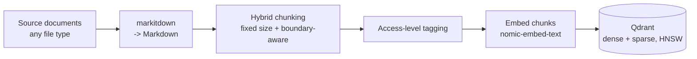
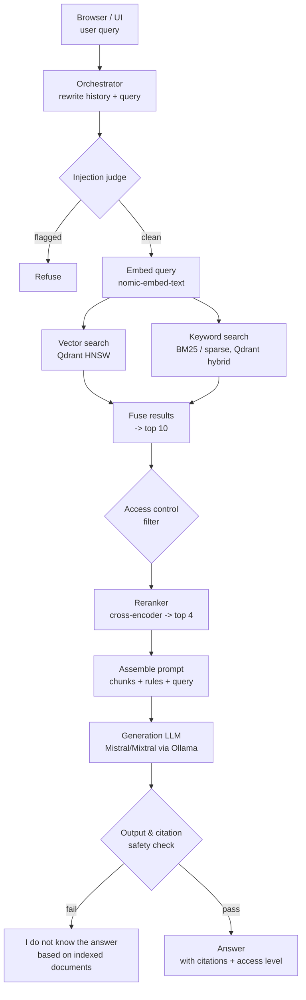

# Agentic RAG

A production-grade agentic retrieval-augmented generation system that answers
questions grounded strictly in an indexed document corpus, with per-user
access control, source citations, and multi-turn chat.

Full spec: [`docs/REQUIREMENTS.md`](docs/REQUIREMENTS.md) · Build plan &
status: [`PROJECT_TRACKER.md`](PROJECT_TRACKER.md) · Working agreement:
[`.claude/CLAUDE.md`](.claude/CLAUDE.md)

## Stack decisions

- **Language:** Python
- **Vector store:** Qdrant (HNSW, native hybrid dense + sparse search)
- **Generation model:** Mistral / Mixtral, served locally via Ollama
- **Embedding model:** `nomic-embed-text`, served locally via Ollama
- **Reranker:** local open-source cross-encoder (`bge-reranker-v2-m3`-class)
- **Evaluation:** Claude (Anthropic API) used as an evaluator/judge, not as the RAG generator
- **Agent orchestration:** custom agent loop, no framework (LangGraph/LlamaIndex not used)
- **Ingestion:** [`markitdown`](https://github.com/microsoft/markitdown) converts any source file type to Markdown

## Architecture

### Ingestion & indexing

### Query journey

Embedding and semantic caches sit alongside the embed/retrieval steps to keep
repeat and similar-meaning queries fast (see `docs/REQUIREMENTS.md` §7). If a
query is complex, the orchestrator may decompose it into sub-questions and
retry retrieval up to 5 times before falling back to the "I do not know"
response (§10).

## Status

**Phase 0 — Project Foundations: complete.**

**Phase 1 — Data Ingestion & Processing: complete.**

Shipped (`src/agentic_rag/ingestion/`):
- Ingestion source-of-truth: a watched folder, with a tier subfolder per
  access level (`tier-2/report.txt`)
- Folder watcher — deterministic snapshot/diff of the folder, no OS-level
  file-watch dependency, so it's fully testable without timing flakiness
- `markitdown`-based conversion of any source file type to Markdown
- Hybrid chunking — fixed target size by default, never splits an oversized
  semantic block (paragraph/list/table) mid-way
- Access-tier tagging, validated against the configured tier list
- Schema validation (`validate_document`) — rejects a document with zero
  usable chunks, empty chunk text, or no access tier before it can reach
  the index
- Per-file failure isolation (bad tagging, a conversion error, *or* a
  failed validation) so one bad file can't stall an entire ingestion cycle
- `sync_folder()` — the ingestion-cycle entrypoint tying all of the above
  together and propagating edits/deletions (FR4)

**Phase 2 — Indexing Layer: complete.**

Shipped (`src/agentic_rag/indexing/`, `src/agentic_rag/embedding/`):
- Qdrant collection setup — local/embedded mode (no Docker in this dev
  environment), HNSW by default, named dense + sparse vectors set up for
  hybrid search from the start
- Dense embeddings via `nomic-embed-text` (Ollama), sparse (BM25)
  embeddings via `fastembed` — populating that hybrid schema
- `index_document()` / `delete_document()` — embed a document's chunks and
  upsert them as Qdrant points with citation/access-control payload.
  Edit-safe (stale points can't survive a shrunk chunk count) and
  idempotent (deterministic point IDs, safe to retry); embeds *before*
  deleting, so a transient embedding failure can't silently vanish an
  already-indexed document
- An embedding cache shared across `index_document()` calls, so repeated
  content across different documents skips re-embedding (verified live:
  ~6.6s → ~0.006s on a cache hit)

**Phase 3 — Retrieval Pipeline: not started.** Parallel hybrid search,
fusion to top 10, reranking to top 4.

See [`PROJECT_TRACKER.md`](PROJECT_TRACKER.md) for the full phased roadmap,
per-item status, and links to the exact module each item lives in.

<!-- Phase log: append a short entry here each time a phase ships. -->
