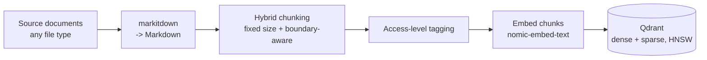
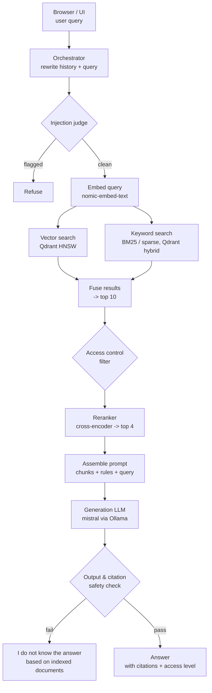

# Agentic RAG

A production-grade agentic retrieval-augmented generation system that answers
questions grounded strictly in an indexed document corpus, with per-user
access control, source citations, and multi-turn chat.

Full spec: [`docs/REQUIREMENTS.md`](docs/REQUIREMENTS.md) · Build plan &
status: [`PROJECT_TRACKER.md`](PROJECT_TRACKER.md) · Working agreement:
[`.claude/CLAUDE.md`](.claude/CLAUDE.md)

## Stack decisions

- **Language:** Python
- **Vector store:** Qdrant (HNSW, native hybrid dense + sparse search)
- **Generation model:** `mistral`, served locally via Ollama (pulled
  during Phase 4 — Mixtral was the other originally-considered option but
  is ~26GB vs. mistral's ~4.1GB, not warranted for local dev)
- **Embedding model:** `nomic-embed-text`, served locally via Ollama
- **Reranker:** local open-source cross-encoder (`bge-reranker-v2-m3`-class)
- **Evaluation:** Claude (Anthropic API) used as an evaluator/judge, not as the RAG generator
- **Agent orchestration:** custom agent loop, no framework (LangGraph/LlamaIndex not used)
- **Ingestion:** [`markitdown`](https://github.com/microsoft/markitdown) converts any source file type to Markdown

## Architecture

### Ingestion & indexing

### Query journey

Embedding and semantic caches sit alongside the embed/retrieval steps to keep
repeat and similar-meaning queries fast (see `docs/REQUIREMENTS.md` §7). If a
query is complex, the orchestrator may decompose it into sub-questions and
retry retrieval up to 5 times before falling back to the "I do not know"
response (§10).

## Status

**Phase 0 — Project Foundations: complete.**

**Phase 1 — Data Ingestion & Processing: complete.**

Shipped (`src/agentic_rag/ingestion/`):
- Ingestion source-of-truth: a watched folder, with a tier subfolder per
  access level (`tier-2/report.txt`)
- Folder watcher — deterministic snapshot/diff of the folder, no OS-level
  file-watch dependency, so it's fully testable without timing flakiness
- `markitdown`-based conversion of any source file type to Markdown
- Hybrid chunking — fixed target size by default, never splits an oversized
  semantic block (paragraph/list/table) mid-way
- Access-tier tagging, validated against the configured tier list
- Schema validation (`validate_document`) — rejects a document with zero
  usable chunks, empty chunk text, or no access tier before it can reach
  the index
- Per-file failure isolation (bad tagging, a conversion error, *or* a
  failed validation) so one bad file can't stall an entire ingestion cycle
- `sync_folder()` — the ingestion-cycle entrypoint tying all of the above
  together and propagating edits/deletions (FR4)

**Phase 2 — Indexing Layer: complete.**

Shipped (`src/agentic_rag/indexing/`, `src/agentic_rag/embedding/`):
- Qdrant collection setup — local/embedded mode (no Docker in this dev
  environment), HNSW by default, named dense + sparse vectors set up for
  hybrid search from the start
- Dense embeddings via `nomic-embed-text` (Ollama), sparse (BM25)
  embeddings via `fastembed` — populating that hybrid schema
- `index_document()` / `delete_document()` — embed a document's chunks and
  upsert them as Qdrant points with citation/access-control payload.
  Edit-safe (stale points can't survive a shrunk chunk count) and
  idempotent (deterministic point IDs, safe to retry); embeds *before*
  deleting, so a transient embedding failure can't silently vanish an
  already-indexed document
- An embedding cache shared across `index_document()` calls, so repeated
  content across different documents skips re-embedding (verified live:
  ~6.6s → ~0.006s on a cache hit)

**Phase 3 — Retrieval Pipeline: complete.**

Shipped (`src/agentic_rag/retrieval/`):
- `hybrid_search()` — dense + sparse search against Qdrant, natively fused
  (RRF) in one call. Prefetches 4× the final limit per leg (RRF only ranks
  over what was already fetched — equal limits would silently drop
  competitive candidates). Dense and sparse query embedding run
  concurrently, not sequentially
- Access-tier filtering (`allowed_tiers_for()`) applied to *both* search
  legs before fusion, not to the fused result afterward (FR3) — verified
  live: a tier-2-only document never appeared in a tier-1 user's results
- `rerank()` — local cross-encoder (`BAAI/bge-reranker-base`, substituted
  for the unsupported `bge-reranker-v2-m3`) reranks the top 10 to a top 4,
  replacing the fusion score with a sharper relevance signal

Semantic cache (originally listed under this phase) is moved to Phase 5 —
it caches generated *answers*, and there's no answer to cache until
generation exists.

**Phase 4 — Orchestration & Multi-Turn Chat: complete.**

Shipped (`src/agentic_rag/orchestration/`, `src/agentic_rag/generation/`):
- `generate()` (`generation/llm_client.py`) — wraps Ollama's `/api/generate`;
  shared by rewriting, decomposition, and (Phase 5) final answer generation
- `rewrite_query()` — folds conversation history + a new query into one
  self-contained query (FR2); no LLM call when there's no history yet
- `decompose_query()` — splits a query into sub-questions, one per LLM
  response line, with list-marker stripping that leaves decimal stats
  (e.g. "1.85 xG") untouched
- `plan_and_retrieve()` — decomposes, retrieves, and reranks per
  sub-question; retries by re-decomposing (up to
  `Settings.max_retrieval_attempts`, default 5, configurable) if any
  sub-question comes back with no reranked candidates. A fixed cutoff on
  the reranker's own score was tried as a tighter relevance signal and
  rejected — live testing showed relevant/irrelevant candidates produce
  overlapping score ranges for short, generic questions, so the coarse
  non-empty signal stayed. `CANNOT_ANSWER_MESSAGE` is the single fallback
  string, exposed as `PlanningResult.message`, for both a direct no-match
  and an exhausted retry budget. Transient callee failures
  (`GenerationError`, `EmbeddingError`, `SparseEmbeddingError`,
  `RerankError`) cost one retry attempt instead of aborting the whole
  call; `UnknownAccessTierError` (a config error) still fails fast

**Phase 5 — Generation & Grounding: complete** (Claude-as-evaluator wiring
deliberately deferred to Phase 8 — see `PROJECT_TRACKER.md`).

Shipped (`src/agentic_rag/orchestration/answer.py`):
- `generate_answer()` — takes Phase 4's `PlanningResult` straight through
  to a final answer. Returns the canonical fallback with no LLM call when
  retrieval was insufficient; otherwise deduplicates candidates across all
  sub-questions into a citation-numbered (`[1]`, `[2]`, ...) source list —
  each labelled with its path, chunk index, and access tier — and prompts
  `mistral` to answer using only those sources, citing every claim, and
  falling back to the canonical message if they don't suffice
- Citations are validated, not just requested: `_is_grounded()` checks the
  returned answer is either the canonical fallback verbatim or cites at
  least one in-range source number; an uncited or hallucinated-citation
  answer is replaced with the fallback rather than returned as-is — prompt
  instructions alone can't satisfy a grounding rule stated as having "no
  exceptions"
- Live-verified this is a genuine second line of defense, not a
  formality: `plan_and_retrieve`'s coarse `sufficient` signal came back
  `True` for "What is the capital of France?" against a football-only
  corpus (retrieval always returns *something*), but `generate_answer()`
  correctly returned the fallback anyway — the model recognized the
  retrieved chunk didn't actually answer the question
- `SemanticCache` + `answer_with_cache()`
  (`src/agentic_rag/orchestration/semantic_cache.py`) — an in-memory,
  linear-cosine-similarity cache from (query meaning, access tier,
  embedding model) to a previously generated answer. Scoped per
  `user_tier`, not just query meaning, since a cached answer was generated
  from retrieval already filtered to the tier that produced it (FR3) — two
  users at different tiers must never share a cache entry. Never caches the
  canonical "I do not know" fallback — self-review found and live-confirmed
  that caching it creates a negative cache that never self-corrects even
  after the relevant document is ingested. A configurable TTL
  (`Settings.semantic_cache_ttl_seconds`, default 300s) bounds how long any
  cached answer, including a correctly-cached one, can outlive the document
  it cites — this system's folder-per-tier access model means a document
  can be reclassified to a stricter tier just by moving it, which the
  cache has no hook to detect on its own. Live-verified: a repeat,
  semantically-similar query at the same tier dropped from 50.8s to 2.2s
  (cache hit); the identical rephrasing at a different tier correctly
  missed the cache and re-ran the full pipeline; an out-of-corpus query
  correctly re-ran the full pipeline on every repeat rather than being
  cached. Claude-as-evaluator wiring is deliberately deferred — no
  Anthropic API key is configured for this project, and its detailed spec
  belongs to Phase 8

See [`PROJECT_TRACKER.md`](PROJECT_TRACKER.md) for the full phased roadmap,
per-item status, and links to the exact module each item lives in.

<!-- Phase log: append a short entry here each time a phase ships. -->
